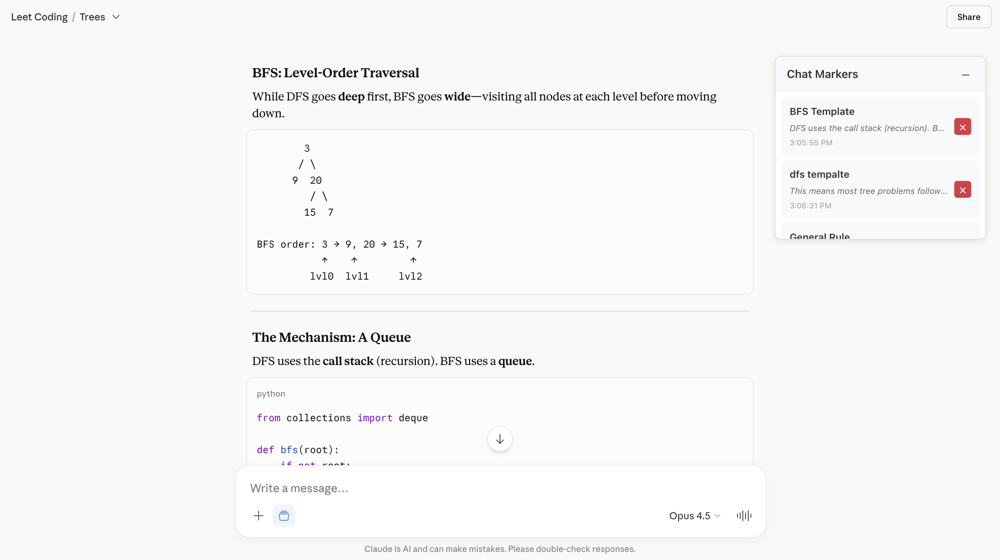
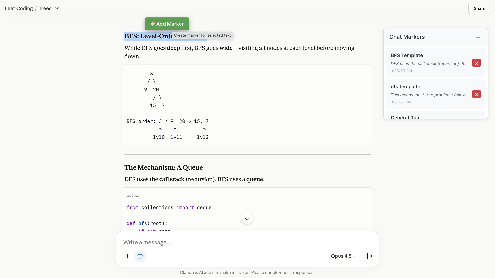
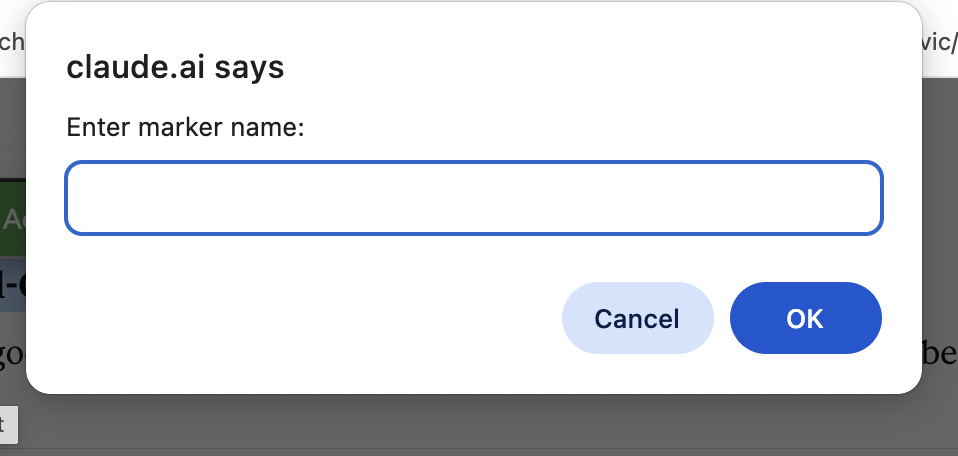
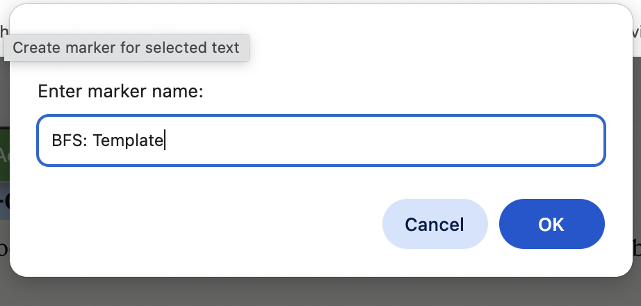
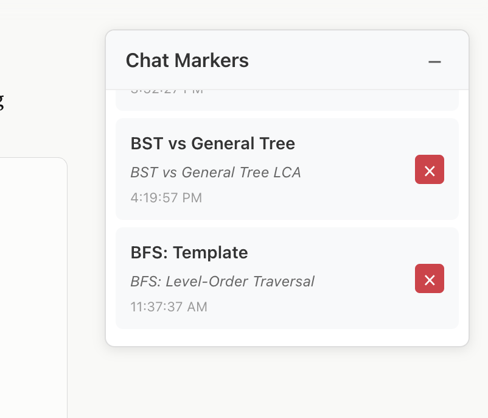

# Claude Chat Markers

A Tampermonkey userscript that lets you bookmark specific text inside a Claude conversation and jump back to it instantly.

## Features

- **Select & mark** — highlight any text in a Claude chat, click the 🔖 button, give it a name
- **Side panel** — draggable panel lists all your markers for the current chat
- **Navigate** — click a marker in the panel to scroll to and highlight that text
- **Per-chat storage** — markers are saved to `localStorage` per conversation, persist across page reloads
- **Panel position memory** — panel position saved per chat, restored on return
- **SPA-aware** — detects URL changes when switching between chats

## Snaps

## Installation

1. Install the [Tampermonkey](https://www.tampermonkey.net/) browser extension
2. Open Tampermonkey dashboard → **Create a new script**
3. Paste the contents of `claude-chat-markers.user.js`
4. Save — the script activates automatically on `claude.ai`

## Usage

1. Open any chat on [claude.ai](https://claude.ai)
2. Select text in any message
3. Click the green **🔖 Add Marker** button that appears
4. Enter a name for the marker
5. Click any marker in the side panel to jump back to it

## Author

Devanathan Sabapathy
